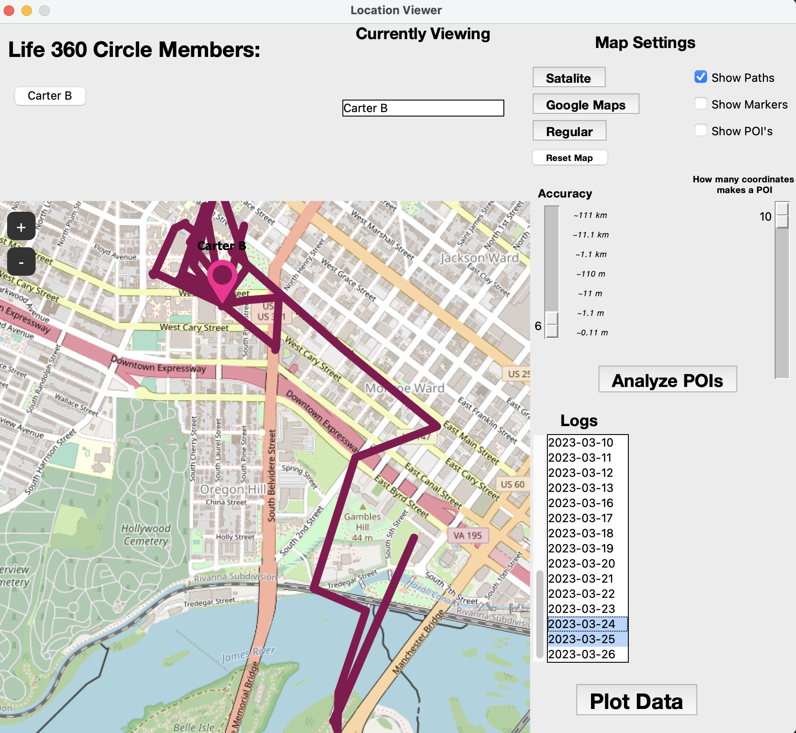

# Triangular-inator
Uses life360 API to access circle data, and store it away in daily .csv files for later viewing, data analysis, and group notifications and records!

### Credits to Harper Reed  (```https://github.com/pnbruckner/life360.git```) for creating the life360 client I used for this project.

## Setup

Make sure you add your information to ```constants.py```  in order to effectively access the API as well as use the visualizer. 

- deviceType = Type of OS you are using, [macos or windows] (macos is same as linux in terms of file system structure)

- debugMode = If you want output printed to the terminal based on what the program is doing live. (for logging or debugging purposes)

- life360_username = Email associated with the life360 account you are logging in with.
- life360_password = Password to your life 360 account.

- timeZone = Timezone you are operating from. i.e 'America/New_York' (You can run the program without selecting a timezone and the program will print all timezones to choose from, then just paste yours into the timeZone variable.

- remote_logs_directory = Where the logs are stored on the separate server you'd want to download them from. i.e "/home/pi/Triangular-inator/logs/"
- local_logs_directory = Where the logs are stored on your machine. i.e "/Users/me/Desktop/Programming/Python/Triangular-inator/logs/"

- serverHostname,serverPort,serverUser,serverPass = These variables are for accessing a separate server to download your data if it is not ran locally, if you have no intention on using this function you can leave these blank.
  
- yourGmail = This is the gmail account that will be sending out updates to all the participants in the life360 circle!
- gmail_SENDING_appPass = this is the [app password you can generate](https://itsupport.umd.edu/itsupport?id=kb_article_view&sysparm_article=KB0015112) for the gmail account that allows it to send and receive mail.


You will need to create sub-folders within the logs folder, one for each member's ***first*** name in your group's circle.

> _For example_
```
   Triangular-inator/logs/Bob/{logs will be made here for Bob}
   Triangular-inator/logs/Dylan/{logs will be made here for Dylan}
   Triangular-inator/logs/Pete/{logs will be made here for Pete}
```
# Requirements

Ensure you have [python installed](https://www.python.org/downloads/) (>3.0), then open a terminal and run -

```pip3 install -r <PATH-OF-requirements.txt>```
This will install all requirements.


The ```life360.py``` file is the framework to actually connect to life-360. ***I did not make this.*** However every other file in this project is original.

logger360 is intended to run headlessly on a computer with constant internet access. It will continuously scrape life360's server for data on your circle, at which point it will log this data to a .csv file.

logger360 logs the following:

- GPS coordinates (lattitude & longitude)
- battery percentage and if currently plugged in
- name
- date & time
- if person is currently in transit
- geographic speed
- timestamps for arriving / leaving a location

Visualizer is for viewing any and all data that is collected in the csv files. just ensure it is in a directory that has a proper logs folder format (as mentioned above) as well as the csv files and it should run without a problem.


<sub>Colored paths for easier differentiation between people.</sub>


<sub>A bigger view.</sub>


<sub>An example of the emails that get sent from mailer.py.</sub>


<sub>Display logged speed of user if they were moving / driving during log.</sub>


<sub>Dynamic information previewing. (i.e if you're just viewing one person it won't show their name, just viewing one date it won't show the date.)</sub>


<sub>Addition of path plotting for each member.</sub>


<sub>POI generation based on how many logs are taken of members at specific locations. The paramaters for POI flagging can be adjusted by the two sliders. </sub>


